## Principios de las gráficas de análisis
### Mostrar comparaciones.
La evidencia de una hipótesis siempre es relativa si no tenemos un punto de comparación. Es decir, siempre hay que mostrar un contraste de condiciones (p.e Control y experimental)

### Mostrar causalidad, mecanismos, estructura sistemática.
Es básicamente cómo creo que se comporta el fenómeno

<!-- -->

### Mostrar datos multivariados
Mostrar más de dos variables. El mundo real es multivariado.

<!-- -->

<!-- -->

## Diagramas de cajas y bigotes
Se convocan con la función `boxplot()`. Y se visualiza el valor mínimo, el cuartil inferior, la mediana, el cuartil superior y el valor máximo. 

```r
x <- rnorm(50)
y <- rnorm(50, 2)
boxplot(x, y)
```

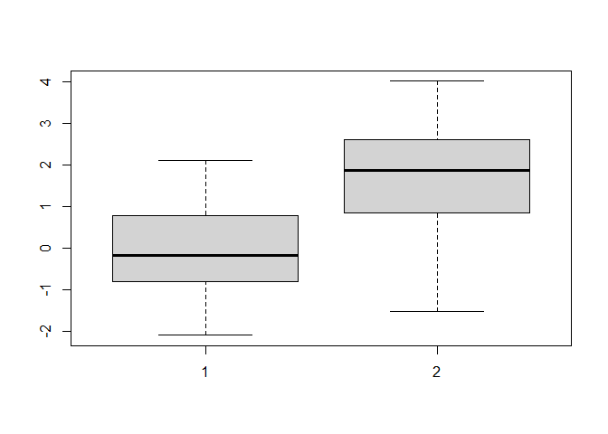<!-- -->

```r
boxplot(airquality$Ozone, airquality$Solar.R)
```

<!-- -->

```r
## Con variables categóricas
airquality$Month <- factor(airquality$Month,
                           labels = c("Mayo", "Junio", "Julio", "Agosto", "Septiembre"))

boxplot(Ozone~Month, data = airquality)
```

<!-- -->

## Histograma
Nos muestra la frecuencia de aparición de cada uno de los datos. 

```r
hist(rnorm(10000))
```

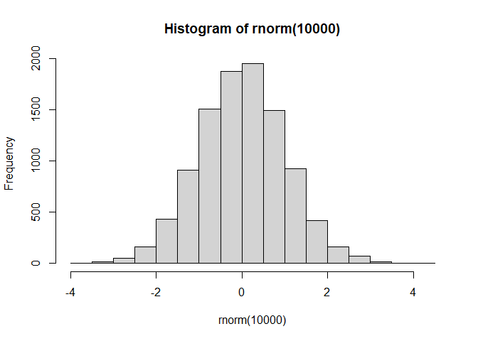<!-- -->

```r
##Breaks
hist(rnorm(10000, 20,5), breaks = 50)
```

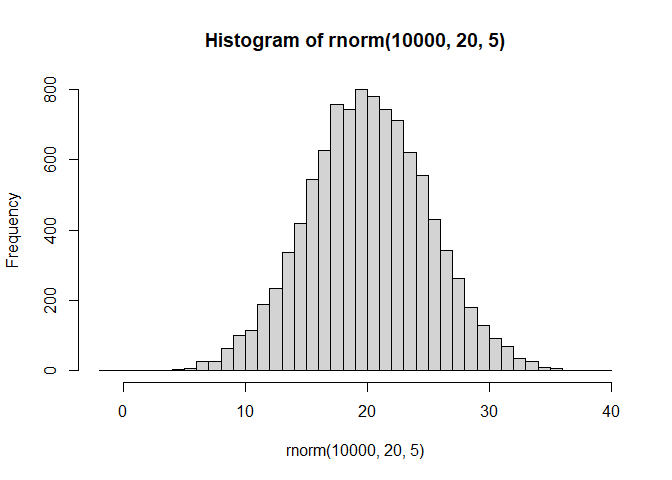<!-- -->

## Gráfica de barras

```r
estatus <- read.csv("./covid/capacidadcovid19CDMX.csv")
barplot(table(estatus$Estatus_capacidad_hospitalaria[estatus$Estatus_capacidad_hospitalaria==c("BUENA", "MEDIA")]),
        main = "estatus", ylab = "no de hospitales")
```

<!-- -->

```r
barplot(c(6,9,6,4,8,3))
```

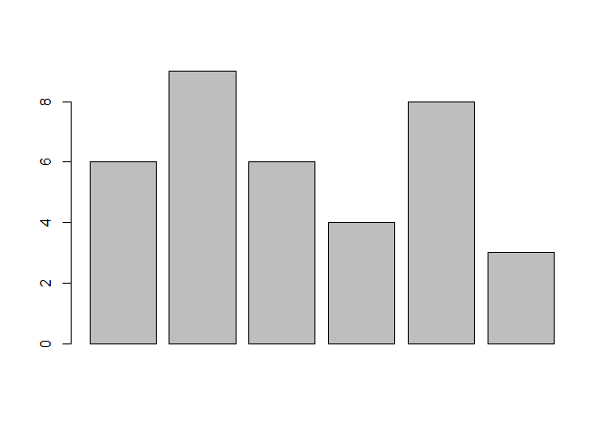<!-- -->

## Diagramas de dispersión
comparar una variable vs otra. Se utiliza para ver relaciones entre variables. se utiliza la función `plot()`

```r
lol.champs <- read.csv("./data/lol_champs.csv")
plot(control, experimental)
```

<!-- -->

```r
plot(lol.champs$HP)
```

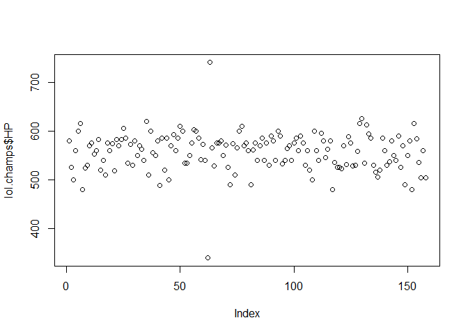<!-- -->

```r
plot(lol.champs$AD, as.numeric(gsub("%", "", lol.champs$Winrate)), ylab = "winrate")
```

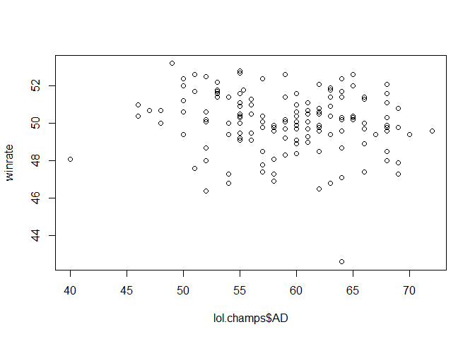<!-- -->

```r
plot(airquality$Wind, airquality$Ozone)
```

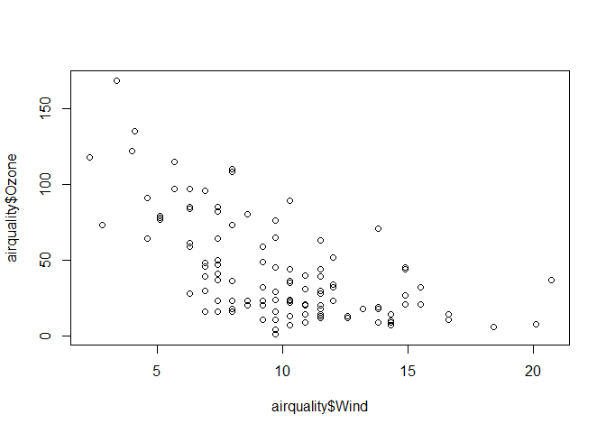<!-- -->

De acuerdo al tipo de variable que vayamos a graficar podemos obtener un diagrama de dispersión o un boxplot (cuando hay variables categóricas).

```r
plot(airquality$Month,airquality$Wind)
```

<!-- -->

```r
plot(airquality$Wind~airquality$Month)
```

<!-- -->

## Funciones de graficado.
### lines
Une los puntos de cada valor por una línea. 

```r
plot(c(5,8,9,15,20), type = "n")
lines(c(5,8,9,15,20))
```

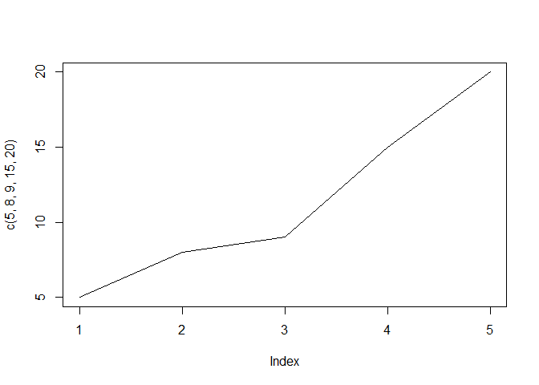<!-- -->

```r
plot(tapply(airquality$Wind,airquality$Month, mean), type = "n")
lines(tapply(airquality$Wind,airquality$Month, mean))
```

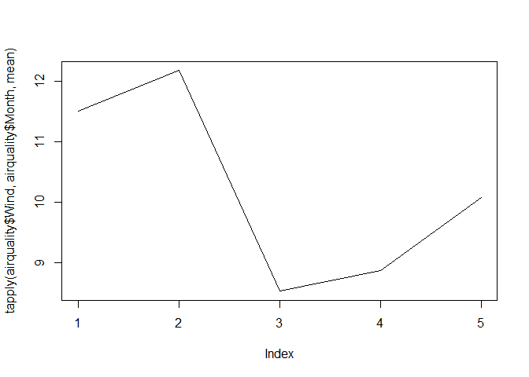<!-- -->

Cuando quiero líneas de un solo subset

```r
plot(airquality$Day,airquality$Wind, type = "n")
with(subset(airquality, Month=="Mayo"), lines(Day, Wind))
with(subset(airquality, Month=="Agosto"), lines(Day, Wind))
```

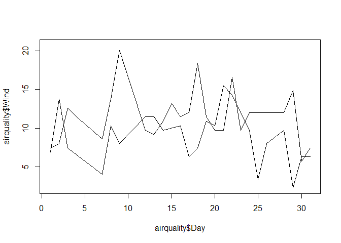<!-- -->

```r
##SINONIMO
plot(airquality$Day,airquality$Wind, type = "n")

lines(airquality[airquality$Month=="Mayo", "Wind"]~airquality[airquality$Month=="Mayo", "Day"])
```

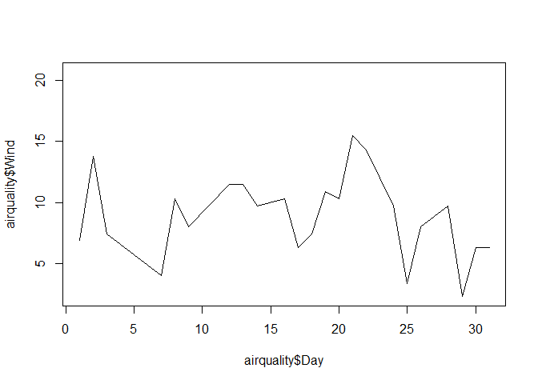<!-- -->

### abline
traza una línea en donde yo le pida.

```r
plot(airquality$Wind,airquality$Ozone)
abline(v=max(airquality$Wind))
abline(h=mean(airquality$Ozone))
```

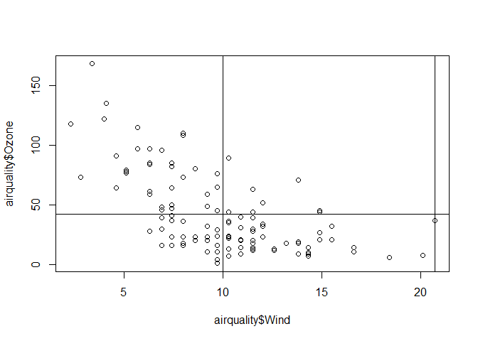<!-- -->

```r
hist(rnorm(10000))
abline(v=c(-2,2))
```

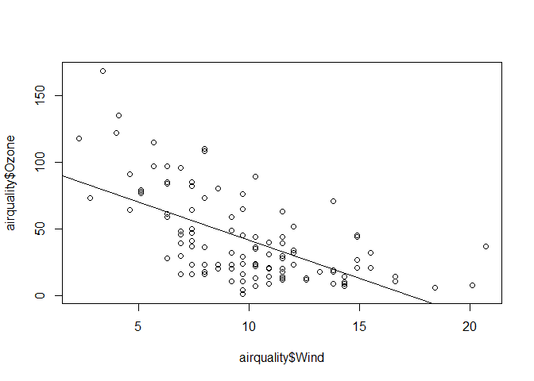<!-- -->

### points

```r
##Todos los puntos
plot(airquality$Ozone, airquality$Wind, type = "n")
points(airquality$Ozone, airquality$Wind)
```

<!-- -->

```r
##sólo un grupo de puntos
with(airquality, plot(Wind, Ozone, type="n"))
with(subset(airquality, Month=="Mayo"), points(Wind, Ozone))
```

<!-- -->

```r
##meses específicos
data <- airquality[airquality$Month %in% c("Mayo", "Agosto"),]
plot(data$Wind, data$Ozone, type = "n")
#puntos de agosto
points(data[data$Month=="Agosto", "Wind"],data[data$Month=="Agosto", "Ozone"] )
```

<!-- -->

```r
##EQUIVALENTE A LA GRAFICA ANTERIOR
with(airquality[airquality$Month %in% c("Mayo", "Agosto"),], 
     plot(Wind, Ozone, type = "n"))
#puntos de agosto
with(subset(airquality, Month == "Agosto"), points(Wind, Ozone))
```

<!-- -->

Podemos también agregar los puntos a una serie de boxplots o a un boxplot. Para ello, hacemos uso de la función `stripchart`. Sus argumentos escenciales son los siguientes:

        stripchart(data or formula, method = "", vertical= TRUE, add=TRUE, pch=1)

```r
boxplot(airquality$Wind)
stripchart(airquality$Wind, method = "jitter", vertical = TRUE, add = TRUE, pch=1)
```

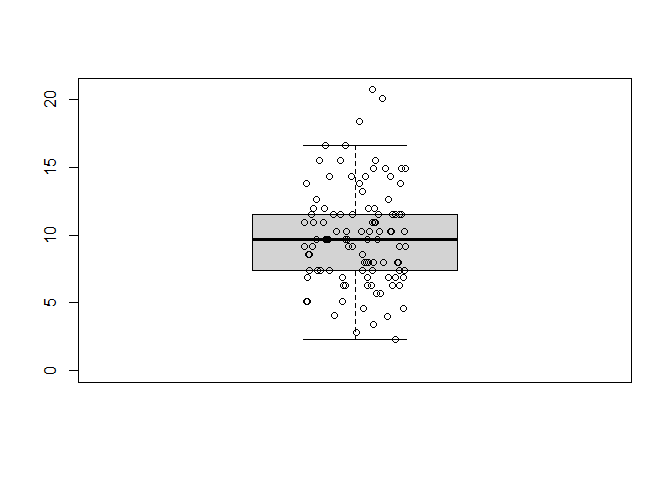<!-- -->

```r
## puntos a una serie de boxplots
boxplot(airquality$Temp~airquality$Month)
stripchart(airquality$Temp~airquality$Month, method = "jitter", vertical = TRUE, add = TRUE, pch=1)
```

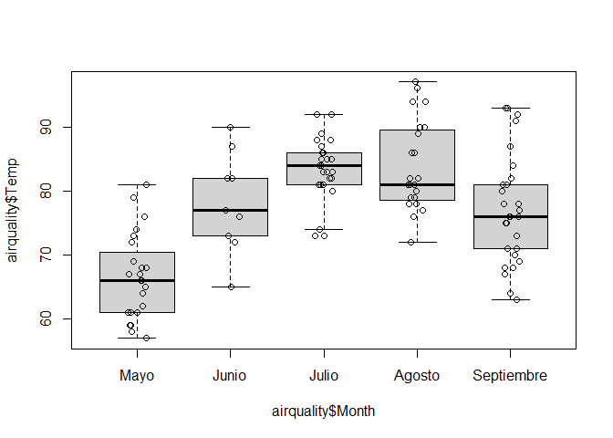<!-- -->

### text

```r
plot(c(3,6,8,10,20), c(4,6,9,6,5), xlab = "x", ylab = "y", ylim = c(0,10))
text(c(3,6,8,10,20), c(4,6,9,6,5)+.7, labels = c("sj1", "sj2", "sj3", "sj4", "sj5"))
```

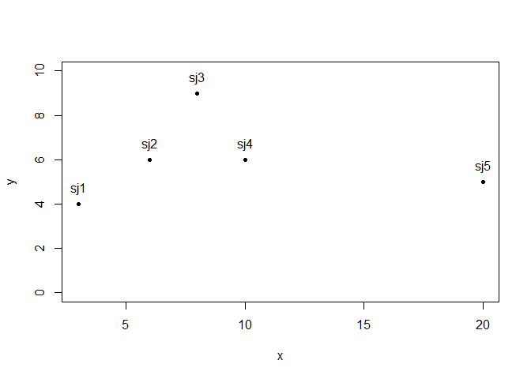<!-- -->
### title

```r
boxplot(Ozone~Month, data = airquality, ylab = "", xlab = "")
title(main = "Calidad del aire", xlab = "Meses", ylab = "Ozono")
```

<!-- -->
### mtext

```r
boxplot(Ozone~Month, data = airquality, main="calidad del aire", xlab = "Meses", ylab = "Ozono")
mtext("hola que hace", 3)
```

<!-- -->

### Algunas funciones se pueden aplicar directamente en las funciones de graficado

```r
with(airquality[airquality$Month %in% c("Mayo", "Agosto"),], 
     plot(Wind, Ozone, main = "calidad del aire", xlab = "viento", ylab = "Ozono", type = "o" ))
```

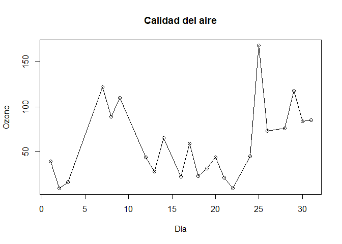<!-- -->

## Parámetros de graficado
### pch

```r
plot(data$Wind, data$Ozone, pch=20)
```

<!-- -->
### lty

```r
plot(data$Wind, data$Ozone, pch=20)
abline(h=50, lty=2)
```

<!-- -->
### lwd

```r
plot(data$Wind, data$Ozone, pch=20)
abline(h=50, lty=2, lwd=2)
```

<!-- -->
### col

```r
plot(data$Wind, data$Ozone, pch=20, col="red")
abline(h=50, lty=2, lwd=1)
```

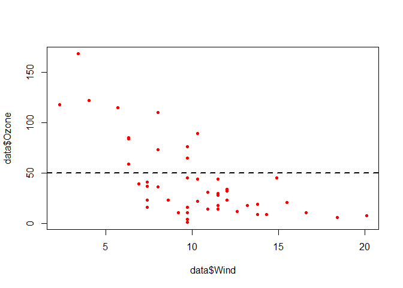<!-- -->

```r
plot(data$Wind, data$Ozone, type="n")
points(data[data$Month=="Agosto", "Wind"],
       data[data$Month=="Agosto", "Ozone"], col="blue", pch=20)
points(data[data$Month=="Mayo", "Wind"],
       data[data$Month=="Mayo", "Ozone"], col="red", pch=1)
```

<!-- -->

```r
plot(data$Wind, data$Ozone, pch=16, col=data$Month)
```

<!-- -->

### xlim
### ylim
### legend

```r
plot(data$Wind, data$Ozone, type="n", xlab = "viento", ylab = "Ozone")
points(data[data$Month=="Agosto", "Wind"],
       data[data$Month=="Agosto", "Ozone"], col="blue", pch=20)
points(data[data$Month=="Mayo", "Wind"],
       data[data$Month=="Mayo", "Ozone"], col="red", pch=1)
legend("topright", legend = c("Mayo", "Agosto"), pch = c(1,20), col = c("red", "blue"))
```

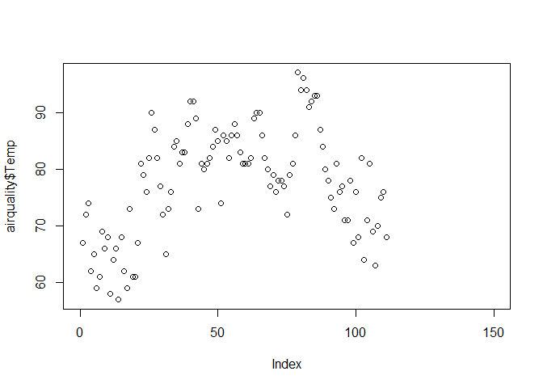<!-- -->


### Función par()
`par()`: Especifica parámetros gráficos globales que van a afectar a todas las gráficas. 
sus parámetros 
- **las**: Indica la orientación de las etiquetas en la gráfica

```r
boxplot(Ozone~Month, data = airquality)
```

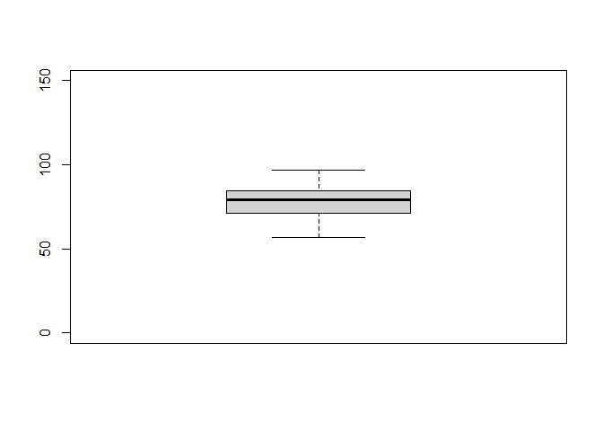<!-- -->

- **bg**
- **mar**
- **omar**
- **mfrow** y **mfcol**
## Gráfica de Violín
Son una alternativa a los diagramas de cajas y bigotes. Nos muestran la densidad de la distribución de los datos. Haremos uso del paquete vioplot. 

Su principio es el siguiente. Nos muestra la distribución de la función de densidad acumulativa de una serie de datos. 


```r
library(vioplot)
x <- rnorm(100000) 
hist(x, freq = F)
lines(density(x), col="red", lwd=2)
par(new=TRUE)
vioplot(x, horizontal = TRUE, yaxt = "n", axes = FALSE, col = rgb(0,.5,.7, alpha = .1))
```

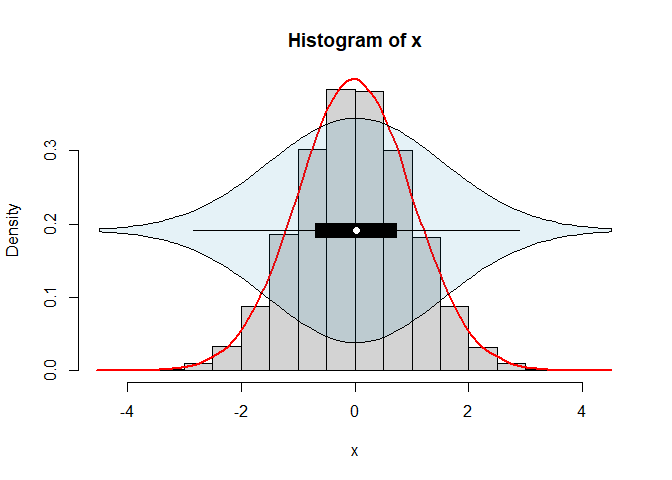<!-- -->

Podemos pasar un vector a la función vioplot. o incluso al igual que un boxplot, hacer varios grupos. 

```r
vioplot(airquality$Solar.R)
```

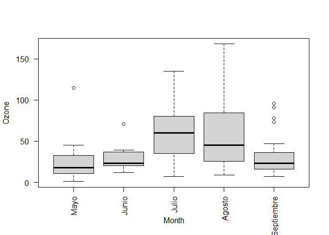<!-- -->

```r
##por diferentes grupos
vioplot(airquality$Wind~airquality$Month, xlab = "meses", ylab = "Viento")
```

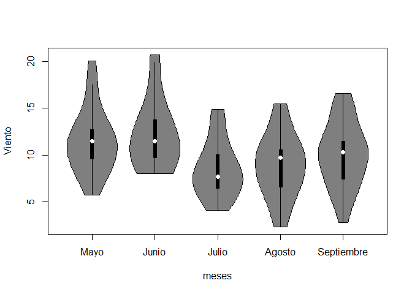<!-- -->

Incluso podemos personalizar las gráficas de violin. utilizando los siguientes parámetros. 
- **col**: color del área de la densidad
- **rectCol**: color del rectángulo
- **lineCol**: color de la línea
- **colMed**: color del punto de la mediana
- **border**: color del borde de la figura.


```r
## col
vioplot(airquality$Solar.R, col = 4)
```

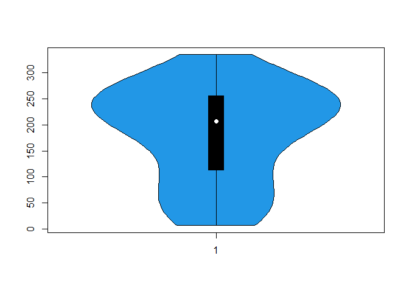<!-- -->

```r
## rectCol
vioplot(airquality$Solar.R, col = 4, rectCol = "red")
```

<!-- -->

```r
## lineCol
vioplot(airquality$Solar.R, col = 4, rectCol = "red", lineCol = 15)
```

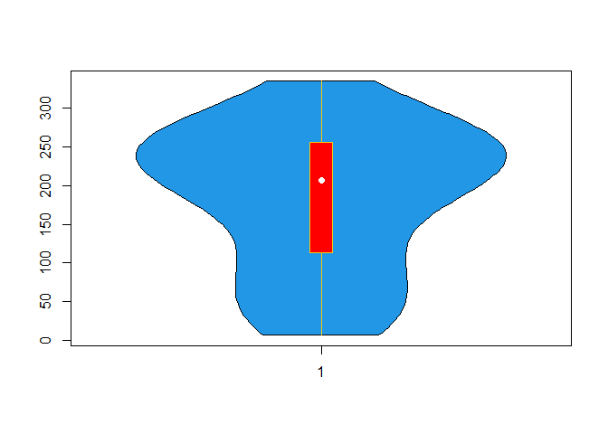<!-- -->

```r
## colMed
vioplot(airquality$Solar.R, col = 4, rectCol = "red", lineCol = 15, colMed = "black")
```

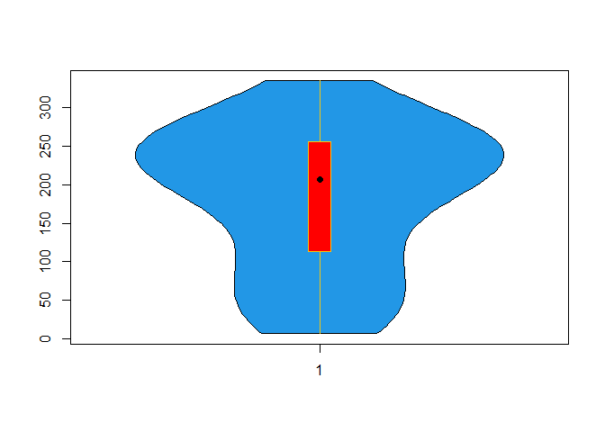<!-- -->

```r
## border
vioplot(airquality$Solar.R, col = 4, rectCol = "red", lineCol = 15, colMed = "black", border = "red3" )
```

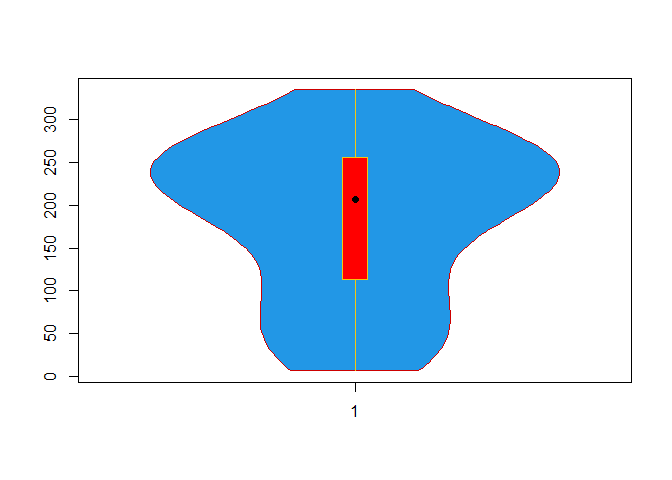<!-- -->

Le aplicamos los parámetros a una serie de vioplots.

```r
vioplot(airquality$Ozone~airquality$Month, col = seq_len(length(levels(airquality$Month))), rectCol=c("white", 1,1,1,1), lineCol=c(0,1,1,1,1), colMed = c("gray",0,0,0,0))
```

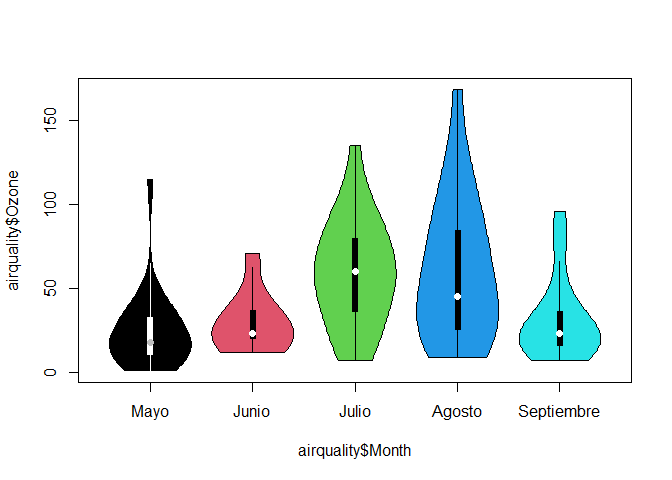<!-- -->


Al igual que un diagrama de cajas y bigotes, yo puedo añadirle los puntos a la gráfica.

```r
vioplot(airquality$Solar.R, col = 4, rectCol = "red", lineCol = 15, colMed = "black", border = "red3" )
stripchart(airquality$Solar.R, add = TRUE, method = "jitter", pch = 20, vertical = TRUE, col = rgb(.2,.4,.7))
```

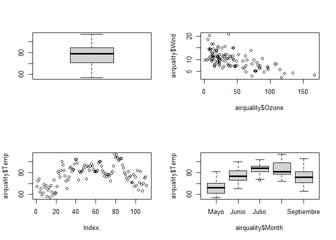<!-- -->

Igual a una serie de graficas.

```r
vioplot(airquality$Ozone~airquality$Month, col = seq_len(length(levels(airquality$Month))), rectCol=c("white", 1,1,1,1), lineCol=c(0,1,1,1,1), colMed = c("gray",0,0,0,0))

x <- seq(0,1, by=.1)

stripchart(airquality$Ozone~airquality$Month, add = TRUE, method = "jitter", pch = 20, vertical = TRUE, col=rgb(sample(x,3),sample(x,1),sample(x,1)))
```

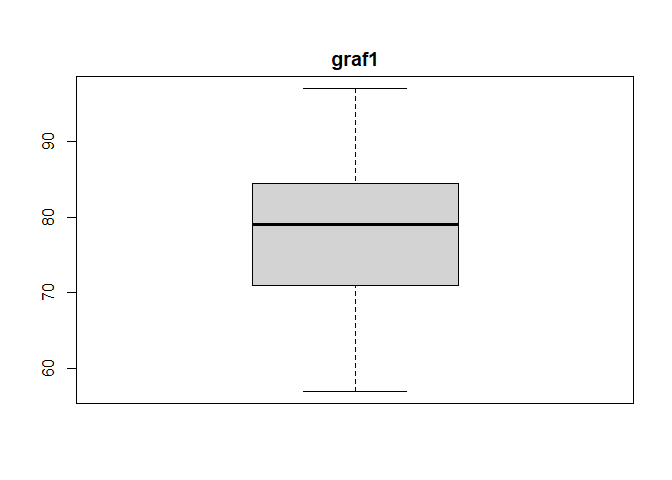<!-- -->

PARA MÁS INFORMACIÓN DE GRÁFICAS DE VIOLÍN CLICK [AQUÍ](https://r-coder.com/violin-plot-en-r/)

## Dispositivos gráficos y exportación

```r
png("./plots/grafica1")
plot(data$Wind, data$Ozone, type="n", xlab = "viento", ylab = "Ozone")
points(data[data$Month=="Agosto", "Wind"],
       data[data$Month=="Agosto", "Ozone"], col="blue", pch=20)
points(data[data$Month=="Mayo", "Wind"],
       data[data$Month=="Mayo", "Ozone"], col="red", pch=1)
legend("topright", legend = c("Mayo", "Agosto"), pch = c(1,20), col = c("red", "blue"))
```


## Paquete ggplot2
